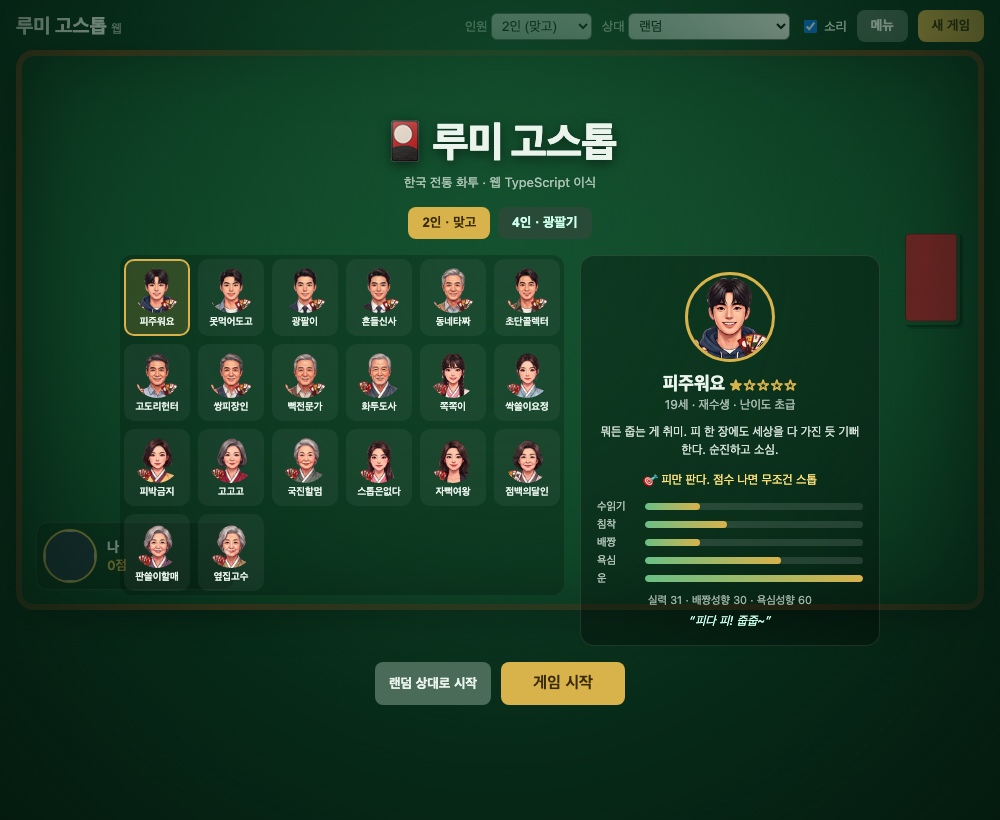

# 🎴 루미 고스톱 — 웹 (gostop-ts)

한국 전통 화투 게임 **고스톱**을, 브라우저에서 바로 즐길 수 있게 만든 TypeScript 이식판입니다.
2인 맞고부터 4인 광팔기까지, 캐릭터 AI와 함께 실제 한 판을 완주할 수 있습니다.



---

## 이 프로젝트에 대하여

원작은 개발자 선배 **안영제(civilian7)** 님이 만든
[**루미 고스톱**](https://github.com/civilian7/gostop) 입니다.
Turbo Pascal · IBM XT 시절부터 이어진 40년 내공이 담긴, Delphi FMX 기반의 완성도 높은 작품이죠.

그런데 원작은 **Windows 전용**이라, **맥 밖에 없는 저는 실행해 볼 수가 없었습니다.**
그래서 게임 엔진 전체를 **TypeScript로 이식**하고 그 위에 **브라우저 UI**를 얹었습니다.

플랫폼이 OS에서 웹으로 바뀌었을 뿐, **규칙·점수·AI·판정은 원작과 비트 단위로 동일**합니다.
(같은 시드 → 같은 셔플 → 같은 대국이 재현되도록 검증되어 있습니다.)

이식 작업은 AI 페어 프로그래밍으로 진행했습니다.
Delphi → TypeScript **코드 변환은 주로 Claude Opus**로 하고,
**검증(원작과의 동일성 대조·리뷰·테스트)은 Fable**로 교차 확인했습니다.

> 원작의 게임 로직·규칙·기획은 모두 선배의 것이며, 이 저장소는 그 저작물을 웹으로 옮긴 파생 작업입니다.
> 아래 **라이선스** 항목에 따라 원작의 비상업 라이선스와 크레딧을 그대로 유지합니다.

---

## 실행 방법

Node.js 18+ 환경이면 됩니다. (Windows·macOS·Linux 어디서든 브라우저만 있으면 실행됩니다.)

```bash
npm install     # 의존성 설치

npm run dev     # 브라우저에서 플레이 → http://localhost:5173
npm test        # 게임 엔진 유닛/통합 테스트 (99개)
npm run build   # 정적 배포 빌드 (dist/)
npm run preview # 빌드 결과 미리보기
```

`npm run dev` 후 브라우저에서 열리는 타이틀 화면에서 상대와 인원을 고르고 바로 시작하면 됩니다.
`?players=3` 처럼 딥링크로 인원 모드를 바로 열 수도 있습니다.

---

## 게임 기능

### 플레이 모드
- **2인 (맞고)** · **3인 (삼파전)** · **4인 (광팔기)** 모두 플레이 가능
- **3인 쇼당** — 상대의 미완성 족보를 내가 완성시킬 수 있으면 쇼당을 걸어 판을 뒤집습니다 (수락/거절·독박 재분배)
- **4인 광팔기** — 손패가 약한 AI는 포기하거나 광을 팔고, 광값을 선불로 정산합니다
- **관전 모드** — 모든 좌석을 AI로 두고 자동 대국을 지켜봅니다

### AI · 캐릭터
- **결정화 몬테카를로 AI** — 수읽기·실수율·고스톱 판단·방어 플레이를 능력치 하나로 조율
- **20종 캐릭터** — 저마다의 페르소나·능력치·플레이스타일·대사, 4종 감정(평상/기쁨/슬픔/분노) 아바타
- 캐릭터의 **운(luck) 스탯**이 매판 뒤집기 바이어스로 실제 게임에 반영됩니다

### 규칙 · 정산
- 먹기 / 뻑 / 쪽 / 따닥 / 쓸 / 폭탄 / 흔들기 / 총통 / 고·스톱 / 나가리 등 **전체 룰 구현**
- **국진 이중 해석**(열끗 ↔ 쌍피), 피박·광박·멍박·고박·역고 등 **박 정산**
- **나가리 판돈 이월**(무승부 시 다음 판 ×2), 판돈 배수는 정산·누적에 반영
- **머니 시스템** — 시드머니 100만 원, 점당 금액 선택, 좌석별 잔액·전적, **오링** 시 도전자 교체/시드 충전

### 연출 · 편의
- **카드 이동 애니메이션(FLIP)** · 셔플/딜/기리(컷) 연출 · 이벤트 배너 · 화면 진동(폭탄/흔들기)
- **효과음** 27종 · 소리 토글
- **자동 저장 / 이어하기**(localStorage) · 세션 **누적 손익**
- ⚙️ **설정** — 닉네임·게임속도(×0.5~×2)·룰 토글, ⏸ 일시정지, 🤖 자동 진행, 정산 후 자동 다음 판
- **인앱 도움말** — 사용설명서·고스톱 룰 문서

---

## 프로젝트 특징

- **엔진 코어 전체 이식 완료.** Delphi 원본 유닛을 1:1로 대응시켜 옮겼습니다.

  | Delphi 원본 | TypeScript | 내용 |
  |---|---|---|
  | `Gostop.Cards.pas` | `src/cards.ts` | 카드 모델 · 48장 카탈로그 · 보너스패 |
  | `Gostop.Deck.pas` | `src/deck.ts` | 구성 · 셔플(시드/보안) · 드로우 · 컷 |
  | `Gostop.Score.pas` | `src/score.ts` | 족보 점수 · 국진 이중 해석 · 고/박 정산 |
  | `Gostop.Deal.pas` | `src/deal.ts` | 딜 구성 · 테이블 상태 · 재분배 · 운 가중 배정 |
  | `Gostop.Play.pas` | `src/play.ts` | 턴 엔진 전체(먹기~고·스톱~정산) |
  | `Gostop.AI.pas` | `src/ai.ts` | 능력치 기반 몬테카를로 AI |
  | `Gostop.FourPlayer.pas` | `src/four-player.ts` | 4인 광팔기 협상 |
  | `Gostop.FourGame.pas` | `src/four-game.ts` | 4인 한 라운드 관리 |
  | `Gostop.Shodang.pas` | `src/shodang.ts` | 3인 쇼당(위협 판정·독박 재분배) |

- **원작과의 동일성 검증.** `test/`의 99개 테스트가 규칙 정합성·완주·재현성을 확인합니다.
  - `test/integration.test.ts` — Deal→Play→정산을 시드별 자동 진행, 항상 제로섬
  - `test/ai.test.ts` — AI 완전 재현성(같은 시드 → 같은 결과), 실력차·제로섬 검증

- **얇은 UI 레이어.** `index.html` · `web/main.ts` · `web/style.css`가 이식된 엔진을 그대로 import 해 구동하는
  순수 DOM UI입니다. 프레임워크 없이 Vite만으로 번들됩니다.

### Delphi → TypeScript 이식 규칙
- `record`(값 타입) → `interface` + 팩토리 (호출마다 새 객체로 값-복사 시맨틱 유지)
- record helper 메서드 → 자유 함수, `static class function` → 객체 리터럴 메서드
- `UInt64` LCG 셔플 → `BigInt` 64비트 마스킹으로 **비트 단위 동일** 순열 재현
- `enum` 서수 → 문자열 유니온(가독성·디버깅 우선)
- Windows `BCryptGenRandom` → `crypto.getRandomValues`(브라우저·Node 공통)
- COM 인터페이스 배관(`QueryInterface`/`_AddRef`/`_Release`) → TS `implements`로 대체(제거)

---

## 라이선스 · 크레딧

이 저장소는 원작의 라이선스를 **그대로 유지**합니다.

- **게임 코드/로직**: [PolyForm Noncommercial License 1.0.0](LICENSE) — **비상업적 용도로만** 사용 가능
  > Required Notice: Copyright (c) 2024-2026 fullbit computing (https://github.com/civilian7)
- **원작**: [civilian7/gostop — 루미 고스톱](https://github.com/civilian7/gostop) (Delphi FMX)
- **이 이식판**: TypeScript · 웹 UI 포팅 작업

### 에셋
- **화투 카드 이미지 48장** — Wikimedia Commons, CC BY-SA 4.0 (`public/hwatu/`)
- **효과음** — [Kenney.nl](https://kenney.nl), CC0 (`public/audio/`)
- **캐릭터 아바타** — Google Gemini 생성 (`public/avatars/`)

원작자 선배님께 감사드립니다. 덕분에 웹에서도 선배의 고스톱을 둘 수 있게 되었습니다. 🙇
